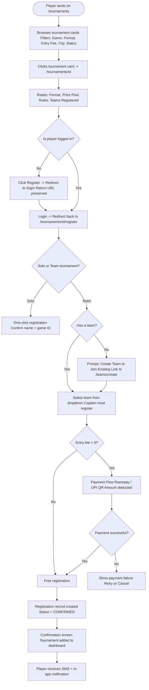
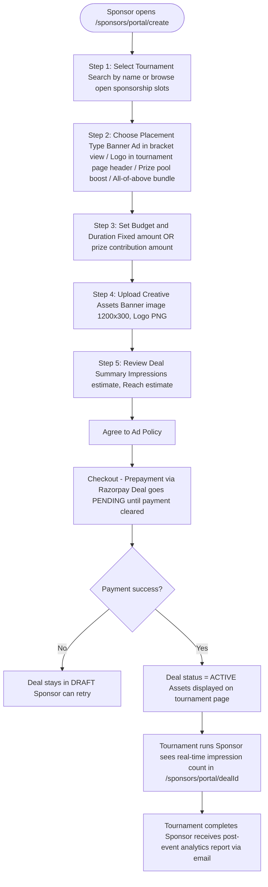
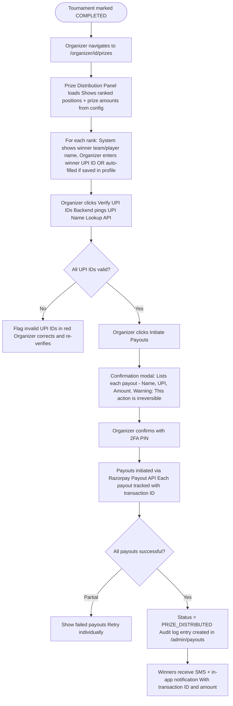
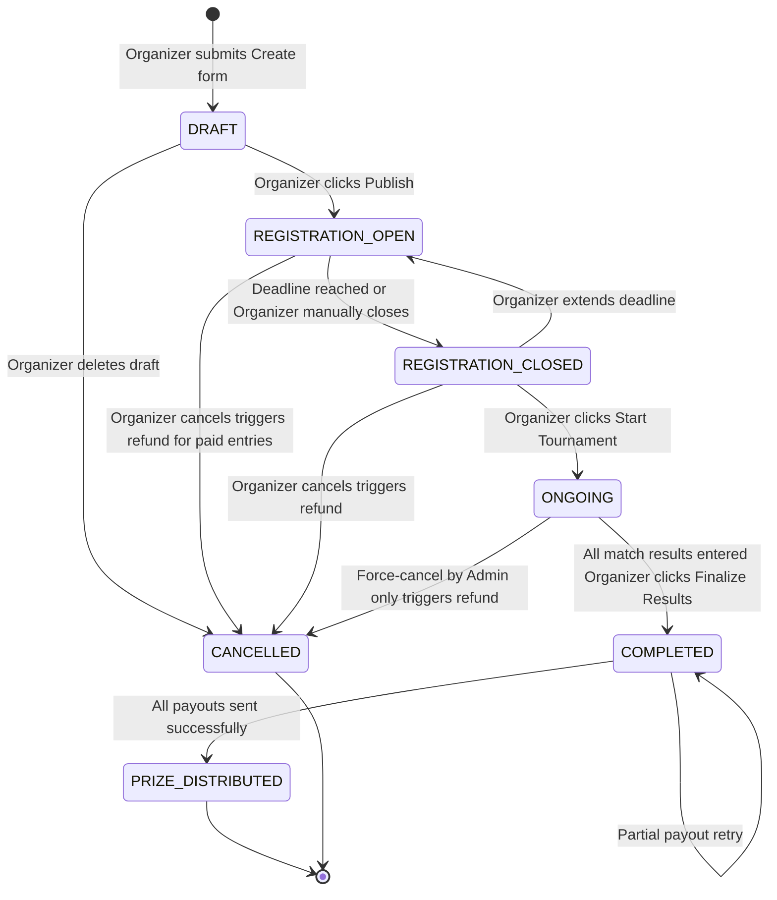

# FFArena — Application Flow Document

> **Project:** FFArena (ffarena.live) — India's Grassroots Esports Infrastructure Platform
> **Version:** 1.0.0
> **Date:** 2026-06-12
> **Stack:** Next.js 14 (App Router) · Supabase (PostgreSQL + Auth + Realtime + Storage) · Vercel · Cloudflare

---

## Table of Contents

1. [Information Architecture](#1-information-architecture)
2. [User Onboarding Flows](#2-user-onboarding-flows)
3. [Core User Journeys](#3-core-user-journeys)
4. [Tournament Lifecycle State Machine](#4-tournament-lifecycle-state-machine)
5. [Screen-by-Screen Breakdown](#5-screen-by-screen-breakdown)
6. [Notification Flow](#6-notification-flow)
7. [Error States & Empty States](#7-error-states--empty-states)

---

## 1. Information Architecture

### 1.1 Full Sitemap / Page Tree

```
ffarena.live/
│
├── / ................................................... Landing Page
├── /about .............................................. About FFArena
├── /blog ............................................... Blog Index
│   └── /blog/[slug] ................................... Blog Post
│
├── ── AUTH ──
├── /login .............................................. Login (OTP)
├── /signup ............................................. Signup (role select)
├── /signup/player ..................................... Player Signup Wizard
├── /signup/organizer .................................. Organizer Signup Wizard
├── /signup/sponsor .................................... Sponsor Signup Wizard
├── /verify ............................................. OTP Verification
├── /auth/callback ...................................... Supabase OAuth Callback
│
├── ── PLAYER ──
├── /dashboard .......................................... Player Home Dashboard
├── /players/[id] ...................................... Public Player Profile
├── /players/[id]/edit ................................. Edit Player Profile
│
├── ── TEAMS ──
├── /teams .............................................. Team Directory
├── /teams/create ....................................... Create a Team
├── /teams/[id] ........................................ Team Profile Page
├── /teams/[id]/edit ................................... Edit Team (Captain only)
├── /teams/[id]/invite ................................. Invite Members (Captain)
│
├── ── TOURNAMENTS ──
├── /tournaments ........................................ Tournament Listing
├── /tournaments/create ................................ Create Tournament (Organizer)
├── /tournaments/[id] .................................. Tournament Detail / Lobby
├── /tournaments/[id]/bracket ......................... Bracket Viewer (live)
├── /tournaments/[id]/rules ........................... Rules & Format Page
├── /tournaments/[id]/results ......................... Final Results & Stats
├── /tournaments/[id]/register ........................ Registration Flow
│
├── ── LEADERBOARDS ──
├── /leaderboards ....................................... Global Leaderboard Hub
├── /leaderboards/[game] .............................. Per-Game Leaderboard
├── /leaderboards/[game]/[region] ..................... City/Region Leaderboard
│
├── ── ORGANIZER ──
├── /organizer .......................................... Organizer Dashboard
├── /organizer/tournaments ............................. My Tournaments List
├── /organizer/[id] .................................... Tournament Control Panel
├── /organizer/[id]/registrations ..................... Registration Manager
├── /organizer/[id]/bracket ........................... Bracket Editor
├── /organizer/[id]/scores ............................ Score Entry Panel
├── /organizer/[id]/prizes ............................ Prize Distribution Panel
├── /organizer/[id]/analytics ......................... Tournament Analytics
├── /organizer/[id]/stream ............................ Stream Integration & Overlays Config
│
├── ── SPONSORS ──
├── /sponsors ........................................... Sponsor Landing Page
├── /sponsors/portal ................................... Sponsor Dashboard
├── /sponsors/portal/create ........................... Create Sponsorship Deal (min ₹2,000)
├── /sponsors/portal/[dealId] ......................... Deal Detail & Audience Reports
│
├── ── ADMIN ──
├── /admin .............................................. Admin Overview
├── /admin/users ....................................... User Management
├── /admin/users/[id] ................................. User Detail
├── /admin/tournaments ................................. All Tournaments
├── /admin/organizers .................................. Organizer Verification Queue
├── /admin/sponsors .................................... Sponsor Management
├── /admin/reports ..................................... Reports & Flags
├── /admin/payouts ..................................... Payout Audit Log
├── /admin/settings .................................... Platform Settings
│
└── ── NOTIFICATIONS / MISC ──
    ├── /notifications .................................. Notification Center
    ├── /settings ....................................... Account Settings
    ├── /settings/notifications ........................ Notification Preferences
    ├── /settings/kyc .................................. KYC / Identity Verification
    ├── /settings/upi .................................. UPI / Payment Settings
    └── /404, /500 ..................................... Error Pages
```

### 1.2 Navigation Structure

#### Primary Navigation (Authenticated)

| Role          | Nav Items                                                  |
| ------------- | ---------------------------------------------------------- |
| **Player**    | Dashboard · Tournaments · Teams · Leaderboards · Profile   |
| **Organizer** | Dashboard · My Tournaments · Create Tournament · Analytics |
| **Sponsor**   | Sponsor Portal · My Deals · Analytics                      |
| **Admin**     | Admin Panel · Users · Tournaments · Reports · Settings     |

#### Secondary Navigation (Always Visible)

- Notification Bell (badge count) → `/notifications`
- Avatar Menu → Profile · Settings · Logout
- Global Search Bar (tournaments, players, teams)

#### Public Navigation (Unauthenticated)

- Logo → `/`
- Tournaments → `/tournaments`
- Leaderboards → `/leaderboards`
- For Sponsors → `/sponsors`
- Login / Sign Up

---

## 2. User Onboarding Flows

### 2.1 New Player Signup

```mermaid
flowchart TD
    A([User visits ffarena.live]) --> B{Has account?}
    B -- Yes --> C[/login]
    B -- No --> D[/signup]
    D --> E[Choose Role: Player]
    E --> F[Enter Mobile Number]
    F --> G[OTP sent via SMS/WhatsApp]
    G --> H[/verify - Enter 6-digit OTP]
    H --> I{OTP valid?}
    I -- No / Expired --> J[Show error + Resend option 30s cooldown]
    J --> H
    I -- Yes --> K[Supabase session created JWT issued]
    K --> L[/signup/player Step 1 Basic Info: Name, DOB, City, State, Preferred UI Language: English/Hindi/Tamil/Telugu/Bengali]
    L --> M[Step 2: Choose Primary Game Free Fire / BGMI / Valorant / COD Mobile]
    M --> N[Step 3: Link Game IDs Enter in-game UID / Username per game]
    N --> O[Step 4: Upload Avatar Optional - Supabase Storage]
    O --> P[Step 5: Agree to Terms, Toggle Voice Announcements Preference, and Community Guidelines]
    P --> Q{All required fields filled?}
    Q -- No --> R[Highlight missing fields inline]
    R --> Q
    Q -- Yes --> S[Profile record inserted in DB Role = player]
    S --> T[Welcome Modal shown Confetti animation]
    T --> U[/dashboard - Player Home]
```

**Key Data Collected:**

- `full_name`, `username` (unique, lowercase, no spaces), `mobile`, `dob`, `city`, `state`
- `primary_game`: enum `(free_fire | bgmi | valorant | codm)`
- `game_ids`: JSONB `{ "free_fire": "UID123", "bgmi": "UID456" }`
- `avatar_url`: Supabase Storage path

**Edge Cases:**

- Mobile number already registered → Show "Login instead?" prompt
- Username already taken → Real-time uniqueness check on blur
- OTP expired (10-minute TTL) → Resend OTP with 30s rate limit, max 3 attempts before 15-min block
- User closes tab mid-wizard → State persisted in `localStorage`; resume on return

---

### 2.2 Organizer Signup

Organizer signup extends the player flow with an additional verification step.

```mermaid
flowchart TD
    A[/signup - Choose Role: Organizer] --> B[Enter Mobile Number]
    B --> C[OTP Verification - same as player]
    C --> D[Basic Info: Name, City, State]
    D --> E[Step: Organization Details Org Name, Type: College Club / City League / Independent Social Media links]
    E --> F[Step: Upload ID Proof Aadhaar / College ID - Supabase Storage]
    F --> G[Step: Organizer Agreement Sign digitally via checkbox + timestamp]
    G --> H[Application submitted Status = PENDING_VERIFICATION]
    H --> I[Admin receives notification in /admin/organizers]
    I --> J{Admin reviews within 48h}
    J -- Approved --> K[Organizer status = VERIFIED Email + SMS sent]
    J -- Rejected --> L[Rejection reason sent via Email + SMS Organizer can re-apply after 7 days]
    K --> M[/organizer - Organizer Dashboard unlocked]
```

**Edge Cases:**

- Document upload fails (>5 MB / unsupported format) → Inline error with format guide
- Admin is unavailable → Auto-escalation after 72 hours to super-admin
- Organizer tries to create tournament while PENDING → Locked UI with "Verification in progress" banner

---

### 2.3 Sponsor Signup

```mermaid
flowchart TD
    A[/signup - Choose Role: Sponsor] --> B[Company Email + Mobile OTP]
    B --> C[Company Details Company Name, GSTIN, POC Name, Designation]
    C --> D[Upload Brand Assets Logo PNG/SVG, Brand Kit ZIP optional]
    D --> E[Describe Campaign Goals Budget Range, Target Games, Target Region]
    E --> F[Agree to Sponsor Terms and Pricing Policy]
    F --> G[Account created Status = ACTIVE]
    G --> H[/sponsors/portal - Sponsor Dashboard]
```

**Key Difference from Player/Organizer:** Sponsors are auto-approved on signup (no manual verification). Full trust gating happens at the deal creation level (prepayment required before deal goes live).

---

## 3. Core User Journeys

### Journey 1: Player — Join a Tournament

**Entry point:** `/tournaments` listing page or direct deep-link



**Exit point:** `/dashboard` with new tournament card in "Upcoming" section

**Edge Cases:**

- Registration limit reached → "Tournament Full" badge; show waitlist option
- Player is already registered → "You're In" badge replaces Register button
- Team missing required player count → Validation error listing missing slots
- Tournament in REGISTRATION_CLOSED state → Locked with countdown to start time
- Player is banned/suspended → Cannot register; banner shows reason + appeal link

---

### Journey 2: Organizer — Create & Run a Tournament (Full Lifecycle)

**Entry point:** `/organizer` dashboard → "Create Tournament" CTA

```mermaid
flowchart TD
    A([Organizer clicks Create Tournament]) --> B[/tournaments/create Step 1: Basic Info Name, Game, Format, Date Range, City]
    B --> C[Step 2: Format Config Solo / Duo / Squad Single Elim / Double Elim / BR Points Max Teams, Check-in window]
    C --> D[Step 3: Prize Pool Setup Total pool, Per-rank breakdown]
    D --> E[Step 4: Entry Fee Free or Paid - set amount in INR]
    E --> F[Step 5: Rules and Description Rich text editor Upload cover image]
    F --> G[Step 6: Sponsor Slot Config Optional - enable sponsor banner, logo slots]
    G --> H[Review and Submit -> Status = DRAFT]
    H --> I{Organizer ready to open registration?}
    I -- No --> J[Saved as DRAFT Visible only to Organizer]
    I -- Yes --> K[Click Publish -> Status = REGISTRATION_OPEN Visible on /tournaments]
    K --> L[Registration period runs Organizer monitors /organizer/id/registrations]
    L --> M[Organizer closes registration manually OR auto-closes at set deadline]
    M --> N[Status = REGISTRATION_CLOSED Bracket auto-generated or manual seed]
    N --> O[/organizer/id/bracket - Bracket Editor Organizer seeds teams, adjusts bracket]
    O --> P[Tournament starts Status = ONGOING]
    P --> Q[Match-by-match score entry /organizer/id/scores]
    Q --> R{All matches played?}
    R -- No --> Q
    R -- Yes --> S[Status = COMPLETED Final results locked]
    S --> T[/organizer/id/prizes Prize Distribution Panel]
    T --> U[Organizer enters winner UPI IDs Initiates payout per rank]
    U --> V[Status = PRIZE_DISTRIBUTED All parties notified]
```

**Edge Cases:**

- Organizer tries to publish without ID verification → Prompt to complete KYC
- Less than minimum teams registered by deadline → Organizer prompted to extend or cancel
- Score dispute raised by team → Dispute flag appears in `/organizer/[id]/scores`; organizer can override
- Organizer abandons mid-creation → Auto-saved draft recoverable from `/organizer` dashboard
- Bracket imbalance (e.g., 5 teams in 8-slot bracket) → Auto-BYE assignment with visual indicator

---

### Journey 3: Sponsor — Create a Sponsorship Deal

**Entry point:** `/sponsors/portal` dashboard → "Create Deal" CTA



**Exit point:** `/sponsors/portal/[dealId]` with live performance metrics

**Edge Cases:**

- Creative asset fails policy check (wrong dimensions / inappropriate) → Admin flags; sponsor notified to re-upload within 24h
- Tournament cancelled after deal payment → Full refund issued automatically
- Sponsor uploads logo > 2 MB → Client-side validation error before upload

---

### Journey 4: Player — View Leaderboard & Profile

**Entry point:** Global nav → "Leaderboards"

```mermaid
flowchart TD
    A([Player navigates to /leaderboards]) --> B[Default view: National / All Games / Monthly]
    B --> C[Applies Filters: Game, Region: National/State/City, Period: Weekly/Monthly/All-time]
    C --> D[Leaderboard table updates via Supabase Realtime Columns: Rank, Avatar, Username, City, Points, Tournaments, Win Rate]
    D --> E[Player clicks own row or any player row]
    E --> F[/players/id - Public Player Profile]
    F --> G[Profile shows: Avatar, Username, City, Primary Game, Stats: Matches/Wins/Win Rate/Points/Prize Earnings, Tournament History, Achievements/Badges]
    G --> H{Viewing own profile?}
    H -- Yes --> I[Edit Profile button visible Link to /players/id/edit]
    H -- No --> J[Follow button visible Share profile button]
```

**Edge Cases:**

- Leaderboard data not yet available (new platform, <10 completed tournaments) → Empty state with "Check back after first week of tournaments"
- Player's profile is set to private → Public profile shows only username + city; stats hidden

---

### Journey 5: Organizer — Distribute Prizes via UPI

**Entry point:** `/organizer/[id]/prizes` (accessible only when tournament Status = COMPLETED)



**Edge Cases:**

- Winner's UPI ID not registered / invalid → Organizer must manually contact winner
- Payout API timeout → Retry with idempotency key; no double-payment risk
- Organizer's account has insufficient balance → Platform shows top-up instructions
- Prize pool was sponsor-funded → Funds already held in escrow; released automatically

---

### Journey 6: Admin — Manage Platform

**Entry point:** `/admin` (Role = admin or super_admin, protected route)

```mermaid
flowchart TD
    A([Admin logs in]) --> B[/admin - Overview Dashboard KPIs: DAU / New Signups / Active Tournaments / Pending Verifications / Flagged Reports]
    B --> C{Admin selects task}
    C --> D[User Management /admin/users Search, filter by role/status View / Suspend / Ban / Role-change]
    C --> E[Organizer Verification Queue /admin/organizers Review submitted ID proofs Approve or Reject with reason]
    C --> F[Tournament Oversight /admin/tournaments View all tournaments Force-cancel / Edit / Flag]
    C --> G[Reports and Flags /admin/reports Player reports, Score disputes, Spam Resolve with action log]
    C --> H[Payout Audit /admin/payouts All payout transactions Filter by status / Export CSV]
    C --> I[Platform Settings /admin/settings Feature flags / Maintenance mode Game catalog / Region list]
```

---

## 4. Tournament Lifecycle State Machine

### 4.1 State Definitions

| State                 | Description                                            | Visible To            |
| --------------------- | ------------------------------------------------------ | --------------------- |
| `DRAFT`               | Created but not published. Organizer is still editing. | Organizer only        |
| `REGISTRATION_OPEN`   | Published. Players can register.                       | Public                |
| `REGISTRATION_CLOSED` | Registration period ended. Bracket being seeded.       | Public (read-only)    |
| `ONGOING`             | Matches are being played. Scores entered live.         | Public (live updates) |
| `COMPLETED`           | All matches done. Winner determined. Scores locked.    | Public                |
| `PRIZE_DISTRIBUTED`   | All prize payouts sent. Tournament fully closed.       | Public                |
| `CANCELLED`           | Tournament cancelled before completion.                | Public                |

### 4.2 State Transition Diagram



### 4.3 Transition Guards & Side Effects

| Transition                                | Guard Condition                                           | Side Effects                                          |
| ----------------------------------------- | --------------------------------------------------------- | ----------------------------------------------------- |
| `DRAFT → REGISTRATION_OPEN`               | Organizer is `VERIFIED`; name, game, date, format all set | Push notification + listing appears on `/tournaments` |
| `REGISTRATION_OPEN → REGISTRATION_CLOSED` | At least 1 team registered                                | Bracket scaffold generated in DB                      |
| `REGISTRATION_CLOSED → ONGOING`           | Min teams ≥ format minimum (e.g., 4 for single-elim)      | In-app + SMS alert to all registered players          |
| `ONGOING → COMPLETED`                     | All match records have a `winner_id`                      | Leaderboard points calculated + awarded               |
| `COMPLETED → PRIZE_DISTRIBUTED`           | All payout transactions have `status = SUCCESS`           | Audit log written; organizer reputation score updated |
| `ANY → CANCELLED`                         | Admin override OR Organizer action (with confirmation)    | Refund jobs queued; registered players notified       |

---

## 5. Screen-by-Screen Breakdown

### 5.1 Landing Page — `/`

| Attribute   | Detail                                                                  |
| ----------- | ----------------------------------------------------------------------- |
| **URL**     | `/`                                                                     |
| **Purpose** | Marketing & conversion page; communicates value prop to all three roles |
| **Access**  | Public                                                                  |

**Key Components:**

- Hero section: Tagline ("India's Grassroots Esports League"), primary CTA "Join a Tournament" + secondary "Host a Tournament"
- Live tournaments ticker (Supabase Realtime — shows 5 most recent REGISTRATION_OPEN tournaments)
- "How It Works" section (3-step explainer for players, organizers, sponsors)
- Featured Leaderboard widget (Top 5 players this week)
- Sponsor logos strip
- Footer: Links · Social · Contact · Terms · Privacy

**Data Sources:**

- `tournaments` table: `status = REGISTRATION_OPEN`, ordered by `created_at DESC`, limit 5
- `leaderboard_weekly` view: top 5 rows

**Actions Available:**

- "Join a Tournament" → `/tournaments` or `/login` if unauthenticated
- "Host a Tournament" → `/signup/organizer` if unauthenticated, else `/tournaments/create`
- "For Sponsors" → `/sponsors`
- Tournament card click → `/tournaments/[id]`

---

### 5.2 Auth Pages

#### `/login`

| Attribute   | Detail                                                     |
| ----------- | ---------------------------------------------------------- |
| **URL**     | `/login`                                                   |
| **Purpose** | Authenticate existing users via mobile OTP                 |
| **Access**  | Public (redirect to `/dashboard` if already authenticated) |

**Key Components:**

- Mobile number input (Indian +91 prefix locked)
- "Send OTP" button → POST `/api/auth/otp/send`
- OTP input (6-digit, auto-submit on last digit)
- Resend OTP link (appears after 30s)
- "New here? Sign up" link → `/signup`

**Edge Cases:** Invalid mobile format → inline validation; Account not found → suggest signup

---

#### `/signup`

| Attribute   | Detail                                             |
| ----------- | -------------------------------------------------- |
| **URL**     | `/signup`                                          |
| **Purpose** | Role selection screen — first step of registration |
| **Access**  | Public                                             |

**Key Components:**

- Three cards: Player · Organizer · Sponsor (with icon + 1-line description each)
- Selecting a card routes to role-specific wizard

---

#### `/verify`

| Attribute   | Detail                                               |
| ----------- | ---------------------------------------------------- |
| **URL**     | `/verify`                                            |
| **Purpose** | OTP verification step shared across all signup flows |
| **Access**  | Public (requires `pending_mobile` in session store)  |

**Key Components:**

- Display masked mobile: "+91 \*\*\*\*1234"
- 6-digit OTP input with auto-advance between boxes
- Timer countdown (10:00 → 00:00)
- Resend OTP (disabled until timer hits 0:00, then active for 30s)
- Back link → `/login` or `/signup`

---

### 5.3 Player Dashboard — `/dashboard`

| Attribute   | Detail                                     |
| ----------- | ------------------------------------------ |
| **URL**     | `/dashboard`                               |
| **Purpose** | Personalized hub for the player's activity |
| **Access**  | Authenticated · Role: player               |

**Key Components:**

- Welcome bar: Avatar + "Good morning, [username]"
- Upcoming Tournaments widget (tournaments player is registered in, sorted by start date)
- Live Tournaments widget (ONGOING tournaments player is in, with live score link)
- Invite Friends CTA (referral link with copy button)
- Recent Activity feed (last 5 events: registered, won, lost, achieved)
- Quick Stats bar: Total Points · Tournaments Played · Win Rate · Prize Earned
- "Find a Tournament" CTA → `/tournaments`

**Data Sources:**

- `registrations` table joined with `tournaments` WHERE `player_id = auth.uid()`
- `player_stats` materialized view
- `notifications` table, last 5 unread

**Actions Available:**

- Click tournament → `/tournaments/[id]`
- View Full Profile → `/players/[auth.uid()]`
- View Leaderboard → `/leaderboards`

---

### 5.4 Tournament Listing — `/tournaments`

| Attribute   | Detail                                        |
| ----------- | --------------------------------------------- |
| **URL**     | `/tournaments`                                |
| **Purpose** | Discover and filter all available tournaments |
| **Access**  | Public                                        |

**Key Components:**

- Filter bar (sticky top):
  - Game: All · Free Fire · BGMI · Valorant · COD Mobile
  - Format: Solo · Duo · Squad
  - Entry: Free · Paid
  - Status: Open · Upcoming · Ongoing · Completed
  - City: Text search
- Sort: Newest · Prize Pool ↑ · Start Date ↑
- Tournament cards (grid, 3-col desktop / 1-col mobile):
  - Cover image, Game badge, Tournament name, Organizer name
  - Entry fee pill, Prize pool, Slots filled / total, Status badge, CTA button
- Pagination: 20 per page, infinite scroll on mobile

**Data Sources:**

- `tournaments` table with filters applied, joined with `organizer_profiles`

**Actions Available:**

- Card click → `/tournaments/[id]`
- Register button on card → `/tournaments/[id]/register`

---

### 5.5 Tournament Detail — `/tournaments/[id]`

| Attribute   | Detail                                                        |
| ----------- | ------------------------------------------------------------- |
| **URL**     | `/tournaments/[id]`                                           |
| **Purpose** | Full tournament information page and registration entry point |
| **Access**  | Public                                                        |

**Key Components:**

- Header: Cover image, Tournament name, Game badge, Status badge
- Info grid: Start Date · End Date · Format · Max Teams · Entry Fee · Prize Pool · City
- Tabs: Overview · Bracket · Rules · Results (tabs visible based on tournament state)
- **Overview tab:** Description, Prize breakdown table, Organizer info card, Registered teams list
- **Bracket tab:** Renders bracket (read-only if REGISTRATION_CLOSED or later)
- **Rules tab:** Rich text rules content
- **Results tab:** Visible once COMPLETED — Final standings table
- Sponsor banner slot (if deal active)
- Registration CTA (sticky bottom on mobile):
  - "Register" (REGISTRATION_OPEN, not yet registered)
  - "You're In ✓" (already registered)
  - "Registration Closed" (disabled)
  - "Tournament Full" (disabled)

**Data Sources:**

- `tournaments` table, `registrations`, `matches`, `sponsor_deals`

**Realtime:** Supabase Realtime subscription on `matches` table for live score updates when status = ONGOING

---

### 5.6 Tournament Bracket — `/tournaments/[id]/bracket`

| Attribute   | Detail                                           |
| ----------- | ------------------------------------------------ |
| **URL**     | `/tournaments/[id]/bracket`                      |
| **Purpose** | Live visual bracket for ongoing tournament       |
| **Access**  | Public (read-only); Organizer sees edit controls |

**Key Components:**

- Single/Double elimination bracket rendered as SVG/canvas component
- Each match node: Team A · vs · Team B · Score A–B
- Winner highlighted in green; loser greyed out
- Live pulsing indicator on current active matches
- Zoom in/out controls; horizontal scroll on mobile
- "My Match" highlight button (for registered players — highlights their branch)

**Data Sources:**

- `bracket_slots` table, `matches` table
- Realtime subscription: `matches` table channel

**Actions (Organizer only):**

- Click match node → opens score entry modal (if in ONGOING state)
- Re-seed button (visible in REGISTRATION_CLOSED state only)

---

### 5.7 Create Tournament — `/tournaments/create`

| Attribute   | Detail                                                       |
| ----------- | ------------------------------------------------------------ |
| **URL**     | `/tournaments/create`                                        |
| **Purpose** | Multi-step form for organizers to configure a new tournament |
| **Access**  | Authenticated · Role: organizer · Status: VERIFIED           |

**Key Components (6-step wizard with progress bar):**

| Step           | Fields                                                                                                                                                               |
| -------------- | -------------------------------------------------------------------------------------------------------------------------------------------------------------------- |
| 1 — Basic Info | Name (max 80 chars), Game select, City, State, Start datetime, End datetime                                                                                          |
| 2 — Format     | Mode (Solo/Duo/Squad), Bracket type (Single Elim / Double Elim / BR Points), Max teams (8/16/32/64), Check-in window (minutes before start), Match duration estimate |
| 3 — Prize Pool | Total prize pool (INR), Per-rank breakdown (add rows: 1st, 2nd, 3rd, ...), Prize funded by: organizer / sponsor-only / mixed                                         |
| 4 — Entry Fee  | Toggle: Free or Paid. If Paid: amount in INR, refund policy select                                                                                                   |
| 5 — Details    | Cover image upload (16:9, max 2 MB), Rules rich text editor (markdown supported), External room ID/password field (for BR games)                                     |
| 6 — Review     | Read-only summary of all steps, Save as Draft button, Publish button                                                                                                 |

**Validation:**

- End datetime must be > Start datetime by at least 2 hours
- Prize breakdown total must equal Total prize pool
- Cover image: client-side resize to 1280×720 before upload

---

### 5.8 Team Management — `/teams` and `/teams/[id]`

#### `/teams`

| Attribute   | Detail                                             |
| ----------- | -------------------------------------------------- |
| **URL**     | `/teams`                                           |
| **Purpose** | Browse all public teams; create a new team         |
| **Access**  | Public browse; Create requires auth + role: player |

**Key Components:**

- Search bar (team name, city)
- Filter: Game · City · Open to Join
- Team cards: Logo · Name · Game · Member count · "Open / Full" badge
- "Create Team" button (top-right, visible to authenticated players)

---

#### `/teams/[id]`

| Attribute   | Detail                               |
| ----------- | ------------------------------------ |
| **URL**     | `/teams/[id]`                        |
| **Purpose** | Team profile: roster, history, stats |
| **Access**  | Public                               |

**Key Components:**

- Team banner + logo, Team name, Game tag, City
- Roster table: Avatar · Username · Role (Captain / Member) · Joined date
- Team stats: Tournaments Entered · Wins · Points
- Tournament history table
- Captain controls (visible to captain only):
  - Invite Member (opens modal with shareable link or search by username)
  - Remove Member
  - Transfer Captaincy
  - Edit Team (name, logo, banner)
  - Disband Team (with confirmation)

---

### 5.9 Player Profile — `/players/[id]`

| Attribute   | Detail                                          |
| ----------- | ----------------------------------------------- |
| **URL**     | `/players/[id]`                                 |
| **Purpose** | Public-facing player profile and stats showcase |
| **Access**  | Public (private mode hides stats)               |

**Key Components:**

- Profile header: Avatar · Username · City · State · Primary Game · Join date
- Stats grid: Tournaments Played · Wins · Win Rate · Total Points · Prize Earnings (INR)
- Game IDs section (displayed for transparency, not editable from this view)
- Achievements / Badges strip (e.g., "First Win", "Top 10 Nationally", "Hat-trick Victor")
- Tournament History table: Name · Game · Rank · Points · Date
- Follow button (if not own profile)
- Share profile button (copies shareable URL)

---

### 5.10 Leaderboards — `/leaderboards`

| Attribute   | Detail                                                          |
| ----------- | --------------------------------------------------------------- |
| **URL**     | `/leaderboards`                                                 |
| **Purpose** | Ranked player standings across games, regions, and time periods |
| **Access**  | Public                                                          |

**Key Components:**

- Filter tabs: National / State / City
- Game selector: All · Free Fire · BGMI · Valorant · COD Mobile
- Time period toggle: Weekly · Monthly · All-time
- Leaderboard table (100 rows max, paginated):
  - Rank · Rank change delta (up/down) · Avatar · Username · City · Points · Win Rate · Tournaments Played
- Top 3 podium design on desktop (gold / silver / bronze cards above table)
- "Your Rank" sticky card at bottom for authenticated players (shows their rank even if not in top 100)

**Data Sources:**

- `leaderboard_national`, `leaderboard_by_city`, `leaderboard_by_game` views
- Refreshed every 15 minutes via Supabase scheduled function

---

### 5.11 Sponsor Portal — `/sponsors` and `/sponsors/portal`

#### `/sponsors` (Public Landing)

| Attribute   | Detail                                        |
| ----------- | --------------------------------------------- |
| **URL**     | `/sponsors`                                   |
| **Purpose** | Convert brands into sponsors — marketing page |
| **Access**  | Public                                        |

**Key Components:**

- Hero: "Reach 50,000+ Engaged Gamers Across India"
- Platform stats: Tournaments hosted · Players registered · Cities covered
- Placement options explained (Banner · Logo · Prize Boost) with mock-up images
- Pricing tiers table (Basic / Growth / Premium)
- "Start Sponsoring" CTA → `/signup/sponsor`

---

#### `/sponsors/portal` (Authenticated Sponsor Dashboard)

| Attribute   | Detail                                           |
| ----------- | ------------------------------------------------ |
| **URL**     | `/sponsors/portal`                               |
| **Purpose** | Sponsor's control center for deals and analytics |
| **Access**  | Authenticated · Role: sponsor                    |

**Key Components:**

- Summary cards: Active Deals · Total Impressions · Total Reach · Total Spent
- Active Deals table: Tournament · Placement · Impressions · Status · Actions
- "Create New Deal" CTA → `/sponsors/portal/create` (Bids starting at ₹2,000)
- Upcoming tournaments with open sponsorship slots

---

#### `/sponsors/portal/[dealId]` (Audience & Campaign Report)

| Attribute   | Detail                                                                                                                  |
| ----------- | ----------------------------------------------------------------------------------------------------------------------- |
| **URL**     | `/sponsors/portal/[dealId]`                                                                                             |
| **Purpose** | Detailed reporting on impressions, clicks, click-through rates, and audience metrics of a specific sponsored tournament |
| **Access**  | Authenticated · Role: sponsor (deal owner)                                                                              |

**Key Components:**

- Campaign Info: Tournament Name · Sponsorship Cost (₹) · Sponsorship Category · Campaign Duration
- KPI Grid: Total Impressions · Click Count · Click-Through Rate (CTR) · Cost Per Click (CPC)
- Demographics charts: Top cities reached · Player age distributions · Gamer category breakdown (Free Fire vs BGMI vs Valorant)
- Logo placement preview tracker: screenshot showing the overlay banner active on live streams
- Export PDF Report button

---

### 5.12 Organizer Dashboard — `/organizer`

| Attribute   | Detail                                             |
| ----------- | -------------------------------------------------- |
| **URL**     | `/organizer`                                       |
| **Purpose** | Central hub for organizer activity                 |
| **Access**  | Authenticated · Role: organizer · Status: VERIFIED |

**Key Components:**

- Verification status banner (if PENDING_VERIFICATION — locks all create actions)
- KPI cards: Active Tournaments · Total Registrations · Total Prize Distributed
- My Tournaments table: Name · Status · Registered · Start Date · Actions
- "Create Tournament" primary CTA
- Recent activity feed (new registrations, disputes, payments)

---

#### Stream Integration Config — `/organizer/[id]/stream`

| Attribute   | Detail                                                                                        |
| ----------- | --------------------------------------------------------------------------------------------- |
| **URL**     | `/organizer/[id]/stream`                                                                      |
| **Purpose** | Configure RTMP push targets (YouTube/Twitch) and manage stream overlay themes / sponsor logos |
| **Access**  | Authenticated · Role: organizer (owner)                                                       |

**Key Components:**

- RTMP Stream Settings: Ingestion Server URL · Stream Key input fields · "Verify Connection" status indicator
- Overlay Configuration wizard:
  - Theme Selector: Accent Color · Font style (Space Grotesk / Inter)
  - Sponsor Logo positioning: Top-Right / Top-Left / Banner strip
  - Live Scoreboard positioning: Bottom-Center overlay toggle
- Live Preview: Mock screen showing dynamic canvas composites of sponsor logos, tournament name, and current bracket round
- "Go Live / Push Stream" toggles

---

### 5.13 Admin Panel — `/admin`

| Attribute   | Detail                                     |
| ----------- | ------------------------------------------ |
| **URL**     | `/admin`                                   |
| **Purpose** | Platform-level management and moderation   |
| **Access**  | Authenticated · Role: admin or super_admin |

**Key Components:**

- Sidebar navigation: Overview · Users · Tournaments · Organizers · Sponsors · Reports · Payouts · Settings
- Overview cards: DAU · WAU · MAU · New Signups (24h) · Pending Organizer Approvals · Open Reports
- Charts: Signups over time · Tournaments by game · Revenue over time

---

### 5.14 Prize Distribution Panel — `/organizer/[id]/prizes`

| Attribute   | Detail                                                         |
| ----------- | -------------------------------------------------------------- |
| **URL**     | `/organizer/[id]/prizes`                                       |
| **Purpose** | Initiate and track prize payouts to winners                    |
| **Access**  | Authenticated · Role: organizer · Tournament status: COMPLETED |

**Key Components:**

- Prize summary: Total pool · Distributed · Pending
- Per-rank rows:
  - Rank · Winner name · Team name · Prize amount · UPI ID field · Status badge
- "Verify All UPI IDs" button
- "Initiate Payout" button (disabled until all UPI IDs verified)
- Transaction log table (after payout initiated): Transaction ID · Recipient · Amount · Status · Timestamp
- Download CSV button (for organizer records)

---

## 6. Notification Flow

### 6.1 In-App Notifications

All in-app notifications are stored in the `notifications` table and delivered via Supabase Realtime to the connected client. The bell icon in the nav shows an unread count badge.

| Trigger Event                 | Recipient | Message                                                          |
| ----------------------------- | --------- | ---------------------------------------------------------------- |
| Registration confirmed        | Player    | "You're registered for [Tournament Name]! It starts on [date]."  |
| Tournament starting in 1 hour | Player    | "⚠️ [Tournament] starts in 1 hour. Check-in now!"                |
| Match ready                   | Player    | "Your match vs [Opponent] is ready. Room ID: [ID], Pass: [Pass]" |
| Match result recorded         | Player    | "Result entered: You [won / lost] vs [Opponent]. Score: X–Y"     |
| Tournament completed (winner) | Player    | "🏆 Congratulations! You placed [Rank] in [Tournament]!"         |
| Prize sent                    | Player    | "💸 ₹[Amount] sent to your UPI [ID]. Txn: [ID]"                  |
| New registration              | Organizer | "New team [Name] registered for [Tournament]"                    |
| Dispute raised                | Organizer | "⚠️ Score dispute raised in match [X vs Y]"                      |
| New deal created              | Sponsor   | "Your deal for [Tournament] is now active!"                      |
| Organizer approved            | Organizer | "✅ Your organizer account is verified!"                         |
| Organizer rejected            | Organizer | "❌ Verification rejected. Reason: [X]. Re-apply after 7 days."  |
| New report filed              | Admin     | "New report: [Type] for [Target]. Review needed."                |

### 6.2 SMS / WhatsApp Notifications

Delivered via **MSG91** (SMS) and **WhatsApp Business API** (WhatsApp). SMS is the fallback; WhatsApp is preferred when user opts in.

| Trigger Event                  | Recipient | Channel      | Message Template                                                                                   |
| ------------------------------ | --------- | ------------ | -------------------------------------------------------------------------------------------------- | ------------- | ---------------- | --------------- |
| OTP during signup/login        | Any       | SMS          | "Your FFArena OTP is [OTP]. Valid for 10 minutes. Do not share."                                   |
| Registration confirmed         | Player    | WhatsApp/SMS | "Hi [Name]! You're registered for [Tournament] on [Date]. Check ffarena.live for room details."    |
| Tournament starting in 2 hours | Player    | WhatsApp     | "🎮 [Tournament] starts in 2 hours! Room ID and password will be shared 15 min before. Good luck!" |
| Room ID/Password shared        | Player    | WhatsApp/SMS | "FFArena Room: [Tournament Name]                                                                   | ID: [Room ID] | Password: [Pass] | Starts: [Time]" |
| Result recorded                | Player    | SMS          | "FFArena: Match result recorded. You placed [Rank]. View: ffarena.live/tournaments/[id]"           |
| Prize sent                     | Player    | WhatsApp/SMS | "💸 FFArena Prize! ₹[Amount] sent via UPI to [UPI ID]. Txn ID: [TxnID]"                            |
| Organizer verification         | Organizer | SMS          | "FFArena: Your organizer account [Approved/Rejected]. Login at ffarena.live"                       |

**Rate limits:** Max 3 SMS per user per hour; WhatsApp limited to 1 message per category per session.

### 6.3 Email Notifications

Delivered via **Resend** (transactional email). All emails use the FFArena branded HTML template.

| Trigger Event                  | Recipient | Subject                                      | Content                                                        |
| ------------------------------ | --------- | -------------------------------------------- | -------------------------------------------------------------- |
| Signup complete                | Any       | "Welcome to FFArena! 🎮"                     | Onboarding guide, links to first tournament, community Discord |
| Organizer application received | Organizer | "Your organizer application is under review" | Timeline, what to expect, contact support                      |
| Organizer approved             | Organizer | "You're verified! Start hosting tournaments" | Link to create first tournament, quick-start guide             |
| Organizer rejected             | Organizer | "Organizer application update"               | Rejection reason, re-application instructions                  |
| Tournament registration        | Player    | "Registration confirmed for [Tournament]"    | Tournament details, rules link, calendar invite attachment     |
| Tournament results             | Player    | "Final results — [Tournament]"               | Standings, their result, points earned                         |
| Prize payment                  | Player    | "Prize money sent — ₹[Amount]"               | Transaction receipt, UPI details, support contact              |
| Sponsor deal active            | Sponsor   | "Your sponsorship deal is live on FFArena"   | Deal summary, performance tracking link                        |
| Weekly digest                  | Player    | "This week in FFArena 🏆"                    | Upcoming tournaments, leaderboard snapshot, news               |

---

## 7. Error States & Empty States

### 7.1 Key Flow Error Handling

#### Authentication Errors

| Scenario                         | Behavior                                                                                           |
| -------------------------------- | -------------------------------------------------------------------------------------------------- |
| Invalid OTP                      | Inline red error: "Incorrect OTP. [X] attempts remaining." Counter resets on resend.               |
| OTP expired                      | "OTP has expired. Click Resend to get a new one." Resend button highlighted.                       |
| Max OTP attempts reached (3)     | Account locked for 15 minutes. Error: "Too many attempts. Try again at [time]."                    |
| Mobile number already registered | "This number is already registered. [Login instead →]"                                             |
| Session expired mid-flow         | Toast notification: "Session expired. Redirecting to login." Stores current URL for redirect-back. |

#### Registration Errors

| Scenario                                 | Behavior                                                                                    |
| ---------------------------------------- | ------------------------------------------------------------------------------------------- |
| Tournament full at time of registration  | "Sorry, this tournament just filled up. You've been added to the waitlist."                 |
| Payment failure                          | "Payment unsuccessful. Your slot is held for 5 minutes. [Retry Payment]"                    |
| Team below minimum size at start         | "Your team needs [N] more members before the tournament starts."                            |
| Player already in conflicting tournament | Warning shown (not a block): "You have another tournament overlapping this time slot."      |
| Organizer not verified                   | Full-page banner: "Complete identity verification to publish tournaments. [Complete KYC →]" |

#### Score/Results Errors

| Scenario                                      | Behavior                                                                                |
| --------------------------------------------- | --------------------------------------------------------------------------------------- |
| Score entry conflict (two organizer sessions) | Optimistic lock: last writer wins with timestamp; conflict alert shown to first editor. |
| Invalid score (e.g., negative number)         | Inline validation: "Score must be 0 or greater."                                        |
| Bracket integrity violation                   | Block submission: "This result creates an impossible bracket state. Check match [X]."   |

#### Payment / Payout Errors

| Scenario                       | Behavior                                                                                                               |
| ------------------------------ | ---------------------------------------------------------------------------------------------------------------------- |
| UPI ID not found               | Red flag on that row: "UPI ID not registered. Verify with winner."                                                     |
| Payout API timeout             | Retry automatically up to 3 times with exponential backoff (2s, 4s, 8s). If all fail: show manual payout instructions. |
| Insufficient organizer balance | "Your FFArena wallet has insufficient funds. [Top Up →]"                                                               |
| Duplicate payout attempt       | Idempotency key check blocks duplicate. Toast: "This payout was already processed. Txn: [ID]"                          |

### 7.2 Empty States

Empty states include an illustration (SVG), a friendly headline, a sub-text explanation, and a primary CTA.

| Screen                               | Condition                    | Headline                     | Sub-text                                                               | CTA                    |
| ------------------------------------ | ---------------------------- | ---------------------------- | ---------------------------------------------------------------------- | ---------------------- |
| `/dashboard` — Upcoming Tournaments  | No registrations             | "No tournaments yet!"        | "Browse open tournaments and join your first one."                     | "Find Tournaments →"   |
| `/tournaments`                       | No results match filters     | "No tournaments found"       | "Try adjusting your filters or check back later."                      | "Clear Filters"        |
| `/teams`                             | No teams in search           | "No teams here"              | "Be the first to create a team in your city!"                          | "Create a Team →"      |
| `/leaderboards`                      | No data for selected filter  | "Leaderboard coming soon"    | "Complete tournaments to earn points and appear here."                 | "Browse Tournaments →" |
| `/organizer`                         | Organizer has no tournaments | "Host your first tournament" | "Create a tournament in minutes and invite players from across India." | "Create Tournament →"  |
| `/organizer/[id]/registrations`      | 0 registrations              | "No registrations yet"       | "Share your tournament link to attract players."                       | "Copy Tournament Link" |
| `/sponsors/portal`                   | No active deals              | "No active deals"            | "Sponsor a tournament to start reaching thousands of Indian gamers."   | "Create a Deal →"      |
| `/notifications`                     | No notifications             | "All caught up!"             | "You have no notifications. Play in tournaments to get updates."       | "Browse Tournaments →" |
| `/admin/reports`                     | No open reports              | "No open reports"            | "The platform is clean. All reports have been resolved."               | —                      |
| `/players/[id]` — Tournament History | Player has no matches        | "No tournament history"      | "Join a tournament to start building your record."                     | "Browse Tournaments →" |

### 7.3 Global Error Pages

#### `/404` — Page Not Found

- Illustration: "404" in pixel/gaming font
- Headline: "Wrong lobby!"
- Sub-text: "This page doesn't exist or may have been moved."
- CTAs: "← Go Back" · "Browse Tournaments"

#### `/500` — Internal Server Error

- Illustration: Broken joystick
- Headline: "Something went wrong on our side"
- Sub-text: "Our team has been notified. Please try again in a moment."
- CTAs: "Try Again" · "Go to Home"
- Includes: Error ID (for support reference): `ERR-[UUID]`

#### Network / Offline State

- Shown when Supabase Realtime disconnects or fetch fails
- Toast (persistent): "⚠️ You appear to be offline. Reconnecting..."
- Live-updating features (bracket, leaderboard) show stale data warning: "Last updated [X] minutes ago"

---

## Appendix A — Role Permission Matrix

| Feature / Action        | Guest | Player | Organizer (Verified) | Sponsor | Admin |
| ----------------------- | ----- | ------ | -------------------- | ------- | ----- |
| Browse tournaments      | ✅    | ✅     | ✅                   | ✅      | ✅    |
| Register for tournament | ❌    | ✅     | ✅                   | ❌      | ❌    |
| Create tournament       | ❌    | ❌     | ✅                   | ❌      | ✅    |
| Enter match scores      | ❌    | ❌     | ✅ (own)             | ❌      | ✅    |
| Distribute prizes       | ❌    | ❌     | ✅ (own)             | ❌      | ✅    |
| Create sponsor deal     | ❌    | ❌     | ❌                   | ✅      | ✅    |
| View leaderboards       | ✅    | ✅     | ✅                   | ✅      | ✅    |
| View any player profile | ✅    | ✅     | ✅                   | ✅      | ✅    |
| Edit own profile        | ❌    | ✅     | ✅                   | ✅      | ✅    |
| Suspend a user          | ❌    | ❌     | ❌                   | ❌      | ✅    |
| Access admin panel      | ❌    | ❌     | ❌                   | ❌      | ✅    |
| Approve organizers      | ❌    | ❌     | ❌                   | ❌      | ✅    |
| Force-cancel tournament | ❌    | ❌     | ❌                   | ❌      | ✅    |
| Export payout CSV       | ❌    | ❌     | ✅ (own)             | ❌      | ✅    |

---

## Appendix B — Key API Endpoints (Next.js Route Handlers)

| Method | Endpoint                                        | Purpose                                         | Auth Required         |
| ------ | ----------------------------------------------- | ----------------------------------------------- | --------------------- |
| POST   | `/api/auth/otp/send`                            | Send OTP to mobile                              | No                    |
| POST   | `/api/auth/otp/verify`                          | Verify OTP, create session                      | No                    |
| POST   | `/api/profile/create`                           | Create player/organizer/sponsor profile         | Yes                   |
| GET    | `/api/tournaments`                              | List tournaments with filters                   | No                    |
| POST   | `/api/tournaments`                              | Create tournament                               | Yes (organizer)       |
| PATCH  | `/api/tournaments/[id]/status`                  | Transition tournament state                     | Yes (organizer/admin) |
| POST   | `/api/tournaments/[id]/register`                | Register player/team                            | Yes (player)          |
| POST   | `/api/tournaments/[id]/matches/[matchId]/score` | Submit match score                              | Yes (organizer)       |
| POST   | `/api/prizes/[tournamentId]/initiate`           | Initiate UPI payouts                            | Yes (organizer)       |
| GET    | `/api/leaderboard`                              | Fetch leaderboard data                          | No                    |
| POST   | `/api/sponsors/deals`                           | Create sponsorship deal                         | Yes (sponsor)         |
| POST   | `/api/admin/organizers/[id]/verify`             | Approve/reject organizer                        | Yes (admin)           |
| POST   | `/api/notifications/send`                       | Internal: trigger notification                  | Service role only     |
| GET    | `/api/v1/tournaments/[id]/stream/config`        | Get stream RTMP server + key                    | Yes (organizer)       |
| POST   | `/api/v1/tournaments/[id]/stream/overlay`       | Save stream overlays, fonts, and sponsor assets | Yes (organizer)       |
| POST   | `/api/v1/sponsors/campaigns`                    | Setup brand sponsorship (min ₹2,000)            | Yes (sponsor)         |
| GET    | `/api/v1/sponsors/campaigns/[id]/report`        | Fetch impressions and clicks logs               | Yes (sponsor)         |

---

_Document maintained by: FFArena Engineering Team_
_Next review date: 2026-07-12_
_Stored at: `C:\Users\raksh\OneDrive\Desktop\Grassroots Esports Infrastructure\AppFlow.md`_
